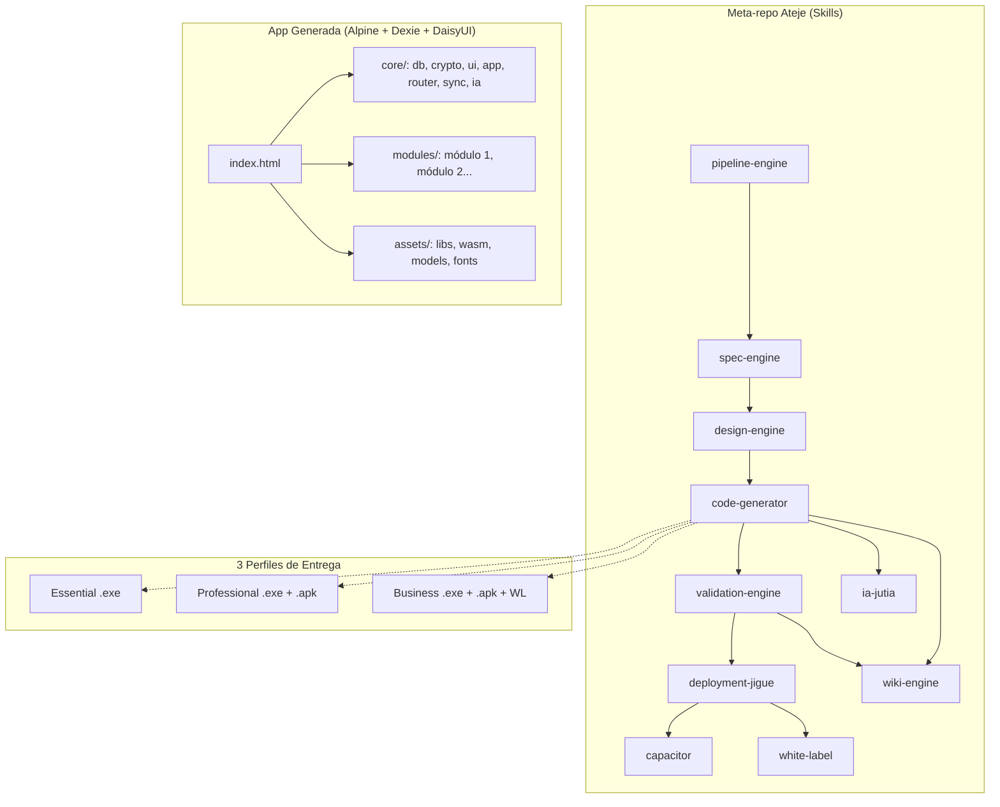

# 🏗️ Presentación Comercial — Ateje Stack + AHApps

> **Documento completo para presentar el Stack, las AHApps, verticales, precios, mercado, ventajas competitivas e IA Jutia.**
> Autor: Angel Hernández Aguilera — [ahaguilera.dev](https://ahaguilera.dev)

---

## Índice

1. [¿Qué es el Ateje Stack?](#1-qu%C3%A9-es-el-ateje-stack)
2. [Catálogo de AHApps (14 apps)](#2-cat%C3%A1logo-de-ahapps)
3. [8 Verticales de Negocio + Kits](#3-8-verticales-de-negocio--kits)
4. [Tabla Única de Precios](#4-tabla-%C3%BAnica-de-precios)
5. [Comparativa de Perfiles (Feature Flags)](#5-comparativa-de-perfiles-feature-flags)
6. [IA Jutia — Mini IA Offline](#6-ia-jutia--mini-ia-offline)
7. [Arquitectura del Stack](#7-arquitectura-del-stack)
8. [Selección de Mercado y Público Objetivo](#8-selecci%C3%B3n-de-mercado-y-p%C3%BAblico-objetivo)
9. [Ventajas Competitivas](#9-ventajas-competitivas)
10. [Resultados Esperados y ROI](#10-resultados-esperados-y-roi)
11. [Preguntas de Descubrimiento por Vertical](#11-preguntas-de-descubrimiento-por-vertical)

---

## 1. ¿Qué es el Ateje Stack?

El **Ateje Stack** no es una app: es un **meta-repo de skills** (SKILL.md autónomos) que genera aplicaciones completas de escritorio (.exe) y móviles (.apk) que funcionan **100% sin internet, sin servidores, sin mensualidades**.

### Filosofía

| Principio | Implicación |
|-----------|-------------|
| **Offline-first** | 100% local, sin servidores, sin internet requerido |
| **Pago único** | El cliente paga una vez, la app es suya para siempre |
| **Sin vendor lock-in** | Datos cifrados AES-256, exportables, portables |
| **IA incluida** | Cada app trae IA Jutia (búsqueda + estadísticas + predicciones) |
| **Código compartido** | ~95% del frontend es idéntico entre perfiles y apps |
| **Sin builds** | Essential se entrega como .exe listo para ejecutar |

### Perfiles Técnicos vs Niveles Comerciales

```
NIVEL COMERCIAL         PERFIL TÉCNICO      ENTREGABLE
───────────────────────────────────────────────────────────
Essential   ──────────► Lite                .exe (Neutralino)
Professional ─────────► Professional        .exe + .apk
Business    ──────────► Business            .exe + .apk + white-label
```

### Stack Tecnológico

| Tecnología | Versión | Rol |
|-----------|:-------:|-----|
| **Alpine.js** | 3.14+ | Reactividad declarativa |
| **Dexie.js** | 4.0+ | IndexedDB wrapper (CRUD offline) |
| **CryptoJS** | 4.2+ | Cifrado AES de campos sensibles |
| **DaisyUI** | 5.x | Componentes UI |
| **Tailwind CSS** | 2.2+ | CSS utility-first, local, sin CDN |
| **Bootstrap Icons** | 1.11+ | Iconos vectoriales |
| **Chart.js** | 4.4+ | Gráficos interactivos |
| **jsPDF** | 2.5+ | Exportación PDF offline |
| **SheetJS (xlsx)** | 0.20+ | Exportación Excel offline |
| **NeutralinoJS** | latest | Runtime .exe nativo (~2MB, sin Java ni Node) |
| **Capacitor** | latest | Runtime .apk Android nativo |

---

## 2. Catálogo de AHApps (14 apps)

Cada app tiene: spec técnica, módulos, tablas Dexie, pricing y mensaje WhatsApp pre-escrito para venta directa.

### Apps Transversales (aparecen en TODAS las verticales)

| App | Propósito | Por qué es transversal |
|-----|-----------|----------------------|
| **AHA Gastos** 💰 | Control financiero: dashboard KPIs, categorías, reportes, predicción IA | Todo negocio necesita saber si gana o pierde dinero |
| **AHA Contactos** 📱 | CRM manual: contactos, historial, recordatorios, plantillas WhatsApp | Toda empresa tiene clientes, proveedores o empleados |

### Apps por Vertical

| App | Propósito | WhatsApp para venta |
|-----|-----------|-------------------|
| **AHA POS** 🏪 | Punto de venta offline: productos, carrito, corte de caja, devoluciones | *"Hola Angel, necesito un punto de venta offline para mi tienda sin pagar mensualidades. ¿AHA POS plan Professional con .exe y .apk?"* |
| **AHA Inventario** 📦 | Control de stock: productos, movimientos, alertas de stock mínimo | *"Hola Angel, necesito controlar mi inventario sin pagar mensualidades. ¿AHA Inventario plan Professional?"* |
| **AHA PreFactura** 📄 | Cotizaciones y facturación: folio automático, PDF, items | *"Hola Angel, necesito facturar sin conexión. ¿AHA PreFactura plan Professional?"* |
| **AHA Comanda** 🍽️ | Pedidos restaurante: mapa de mesas, split de cuenta, comanda a cocina | *"Hola Angel, vi la AHA Comanda para mi restaurante. ¿Puedo tener el .exe y .apk con todos los módulos? Me interesa el plan Professional."* |
| **AHA CRM** 💼 | Pipeline Kanban: contactos, deals, cotizaciones, facturación | *"Hola Angel, necesito un CRM offline para gestionar mis clientes y ventas sin mensualidades. ¿AHA CRM con pipeline Kanban?"* |
| **AHA Citas** 💇 | Agenda visual: calendario semanal, servicios, profesionales, ingresos | *"Hola Angel, necesito organizar las citas de mi barbería sin pagar mensualidades. ¿AHA Citas plan Professional con .exe y .apk?"* |
| **AHA Asistencia** ⏰ | Control horario: empleados, QR, reportes CSV para nómina | *"Hola Angel, quiero dejar de pagar suscripción por el control de asistencia. ¿AHA Asistencia plan Professional con .exe y .apk me sirve para 15 empleados?"* |
| **AHA Rx** ⚕️ | Recetas médicas: pacientes, medicamentos, recetas PDF, historial | *"Hola Angel, necesito digitalizar las recetas de mi consultorio sin mensualidades. ¿AHA Rx plan Professional?"* |
| **AHA Obra** 🏗️ | Construcción: obras, etapas, materiales, personal, presupuesto vs real | *"Hola Angel, necesito controlar los gastos y avance de mis obras sin pagar mensualidades. ¿AHA Obra plan Professional con .exe y .apk?"* |
| **AHA Campo** 🌾 | Agricultura: lotes, cultivos, insumos, cosechas, animales, eventos | *"Hola Angel, trabajo en el campo y casi nunca tengo internet. Quiero AHA Campo para llevar registro de mis lotes y ganado desde el celular. Plan Professional con .apk."* |
| **AHA Flota** 🚚 | Control vehicular: combustible, mantenimiento, incidentes, rendimiento | *"Hola Angel, necesito controlar los gastos de mis vehículos sin pagar mensualidades. ¿AHA Flota plan Professional con .exe y .apk?"* |
| **AHA Checklist** ✅ | Inspecciones: plantillas, fotos, firma digital, PDF con evidencias | *"Hola Angel, necesito un sistema de inspecciones offline para mantenimiento. Me interesa AHA Checklist plan Professional con .exe y .apk."* |
| **AHA Gastos** 💰 | Control financiero: dashboard, categorías, presupuestos, gráficos | *"Hola Angel, necesito controlar los gastos de mi negocio sin herramientas online. ¿AHA Gastos con reportes PDF?"* |
| **AHA Contactos** 📱 | Agenda inteligente: directorio, etiquetas, grupos, recordatorios | *"Hola Angel, necesito organizar mis contactos de WhatsApp y dar seguimiento a clientes. ¿AHA Contactos con recordatorios?"* |

---

## 3. 8 Verticales de Negocio + Kits

### 🏪 VERTICAL 1: COMERCIO Y RETAIL
**Target:** Ferreterías, abarrotes, tiendas de ropa, farmacias, minimarkets
**Dolor:** *"Si se va internet no cobro y no sé qué tengo en stock"*

| App | Rol |
|-----|-----|
| **AHA POS** | ⭐ Motor de ventas |
| AHA Inventario | Control de stock |
| AHA PreFactura | Facturación local |
| AHA Gastos | Control financiero |
| AHA Contactos | CRM de clientes |

| Perfil | Precio |
|--------|:------:|
| Essential | $199 |
| Professional | $399 |
| Business | $699 |

---

### 🍽️ VERTICAL 2: GASTRONOMÍA
**Target:** Restaurantes, bares, cafeterías, taquerías, food trucks
**Dolor:** *"Los pedidos en papel se pierden y la cocina tarda"*

| App | Rol |
|-----|-----|
| **AHA Comanda** | ⭐ Motor de pedidos |
| AHA POS | Cobro y corte de caja |
| AHA Inventario | Control de insumos |
| AHA Gastos | Gastos operativos |
| AHA Asistencia | Control de empleados |

| Perfil | Precio |
|--------|:------:|
| Essential | $249 |
| Professional | $449 |
| Business | $849 |

---

### 💇 VERTICAL 3: BELLEZA Y SERVICIOS
**Target:** Barberías, peluquerías, salones de uñas, spas, tatuadores
**Dolor:** *"Se me cruzan las citas y pierdo clientes por no dar seguimiento"*

| App | Rol |
|-----|-----|
| **AHA Citas** | ⭐ Agenda visual |
| AHA Contactos | Historial y seguimiento |
| AHA Gastos | Control financiero |
| AHA Asistencia | Control de empleados |

| Perfil | Precio |
|--------|:------:|
| Essential | $179 |
| Professional | $349 |
| Business | $699 |

---

### ⚕️ VERTICAL 4: SALUD Y CONSULTORIOS
**Target:** Médicos independientes, dentistas, fisioterapeutas, farmacias
**Dolor:** *"Mis recetas se pierden y no tengo historial clínico digital"*

| App | Rol |
|-----|-----|
| **AHA Rx** | ⭐ Recetas e historial |
| AHA Citas | Agenda de pacientes |
| AHA Contactos | Seguimiento |
| AHA PreFactura | Facturación |
| AHA Gastos | Control del consultorio |

| Perfil | Precio |
|--------|:------:|
| Essential | $199 |
| Professional | $399 |
| Business | $799 |

---

### 🏗️ VERTICAL 5: CONSTRUCCIÓN Y OBRA
**Target:** Constructores, arquitectos, contratistas, ingenieros
**Dolor:** *"Los gastos se disparan y no tengo control del avance en obra"*

| App | Rol |
|-----|-----|
| **AHA Obra** | ⭐ Control de obra |
| AHA Checklist | Inspecciones |
| AHA PreFactura | Certificaciones |
| AHA Gastos | Control presupuestario |

| Perfil | Precio |
|--------|:------:|
| Essential | $249 |
| Professional | $499 |
| Business | $999 |

---

### 🌾 VERTICAL 6: CAMPO Y AGRO
**Target:** Agricultores, ganaderos, ranchos, cooperativas agrícolas
**Dolor:** *"En el campo no hay internet. Llevo todo en libreta"*

| App | Rol |
|-----|-----|
| **AHA Campo** | ⭐ Lotes y cultivos |
| AHA Inventario | Control de insumos |
| AHA Flota | Maquinaria agrícola |
| AHA Gastos | Control por lote |

| Perfil | Precio |
|--------|:------:|
| Essential | $199 |
| Professional | $399 |
| Business | $799 |

---

### 🚚 VERTICAL 7: LOGÍSTICA Y TRANSPORTE
**Target:** Empresas de transporte, flotillas, repartidores, mensajerías
**Dolor:** *"No sé cuánto gasto en gasolina ni cuándo toca mantenimiento"*

| App | Rol |
|-----|-----|
| **AHA Flota** | ⭐ Control vehicular |
| AHA Asistencia | Control de choferes |
| AHA Checklist | Inspecciones |
| AHA Gastos | Control por vehículo |

| Perfil | Precio |
|--------|:------:|
| Essential | $199 |
| Professional | $399 |
| Business | $799 |

---

### 💼 VERTICAL 8: OFICINA Y FREELANCERS
**Target:** Contadores, abogados, freelancers, agencias pequeñas
**Dolor:** *"Tengo clientes en WhatsApp, Excel y correos - no tengo un solo lugar"*

| App | Rol |
|-----|-----|
| **AHA CRM** | ⭐ Pipeline Kanban |
| AHA Contactos | Gestión de contactos |
| AHA PreFactura | Facturación |
| AHA Gastos | Control financiero |

| Perfil | Precio |
|--------|:------:|
| Essential | $149 |
| Professional | $299 |
| Business | $599 |

---

## 4. Tabla Única de Precios

### Apps Individuales

| App | Essential (.exe) | Professional (.exe+.apk) | Business (white-label) |
|-----|:----------------:|:-----------------------:|:---------------------:|
| AHA POS | $49 | $99 | $199 |
| AHA Inventario | $49 | $99 | $199 |
| AHA Comanda | $49 | $99 | $199 |
| AHA Citas | $49 | $99 | $199 |
| AHA Rx | $49 | $99 | $149 |
| AHA CRM | $49 | $99 | $199 |
| AHA Contactos | $39 | $79 | $149 |
| AHA Gastos | $39 | $79 | $149 |
| AHA PreFactura | $29 | $49 | $99 |
| AHA Campo | $49 | $99 | $199 |
| AHA Obra | $49 | $99 | $199 |
| AHA Checklist | $49 | $99 | $199 |
| AHA Flota | $49 | $99 | $199 |
| AHA Asistencia | $49 | $99 | $199 |
| AHA Base | Gratis | $49 | $149 |

> **Essential:** .exe funcional, 30 registros, IA Lite. Ideal para probar sin riesgo.
> **Professional:** .exe + .apk, ilimitado, IA Full, export/sync/backup. Para uso real.
> **Business:** Todo lo de Professional + white-label + multi-usuario + API. Para empresas.

### Kits por Vertical

| Vertical | Essential | Professional | Business | Apps |
|----------|:---------:|:------------:|:--------:|------|
| Comercio & Retail | $199 | $399 | $699 | 5 apps |
| Gastronomía | $249 | $449 | $849 | 5 apps |
| Belleza & Servicios | $179 | $349 | $699 | 4 apps |
| Salud & Consultorios | $199 | $399 | $799 | 5 apps |
| Construcción & Obra | $249 | $499 | $999 | 4 apps |
| Agro & Campo | $199 | $399 | $799 | 4 apps |
| Logística & Transporte | $199 | $399 | $799 | 4 apps |
| Oficina & Freelancers | $149 | $299 | $599 | 4 apps |

> **Pago único, sin mensualidades.** App adicional al kit: -20% sobre precio individual.

---

## 5. Comparativa de Perfiles (Feature Flags)

Controlado por `feature-flags.js` en runtime — define qué puede hacer cada perfil:

| Feature | Essential | Professional | Business |
|---------|:---------:|:------------:|:--------:|
| **Max registros** | 30 | Ilimitado | Ilimitado |
| **Exportar datos** | ✅ | ✅ | ✅ |
| **Sync entre dispositivos** | ❌ | ✅ | ✅ |
| **Backup .ateje-backup** | ✅ | ✅ | ✅ |
| **White-label (marca propia)** | ❌ | ❌ | ✅ |
| **IA Jutia** | Lite (FlexSearch + stats + predict) | Full (QA + OCR + RAG) | Full (QA + OCR + RAG) |
| **Multi-usuario** | ❌ | ❌ | ✅ |
| **API access** | ❌ | ❌ | ✅ |
| **Max dispositivos** | 1 | 5 | 200 |
| **Formato entrega** | .exe | .exe + .apk | .exe + .apk + WL |
| **HTML visible** | ✅ (Sí) | ❌ (No) | ❌ (No) |
| **Código fuente** | ❌ | ❌ | ✅ |
| **Soporte** | Estándar | Estándar | Prioritario 48h |

---

## 6. IA Jutia — Mini IA Offline

### ¿Qué es IA Jutia?

**IA Jutia** es una inteligencia artificial que corre **100% local** dentro de cada AHApp. No envía datos a ningún servidor externo. Viene **incluida en el precio** de cada app.

```
┌─────────────────────────────────────────────────────────────┐
│                    AHA [App: CRM, POS, etc.]                │
│  ┌───────────────────────────────────────────────────────┐  │
│  │  Engine IA Jutia (transversal, todas las pantallas)  │  │
│  │                                                       │  │
│  │  ┌──────────────┐  ┌──────────────┐  ┌────────────┐  │  │
│  │  │  FlexSearch   │  │ Transformers │  │ Tesseract  │  │  │
│  │  │  (Búsqueda)  │  │  (QA/Embed)  │  │ (OCR)      │  │  │
│  │  └──────────────┘  └──────────────┘  └────────────┘  │  │
│  │                                                       │  │
│  │  ┌──────────────────────────────────────────────────┐ │  │
│  │  │  JutiaDB (Dexie) — conversaciones + mensajes     │ │  │
│  │  └──────────────────────────────────────────────────┘ │  │
│  │                                                       │  │
│  │  Capacidades: Stats 📊  |  Predict 🔮  |  Search 🔍  │  │
│  └───────────────────────────────────────────────────────┘  │
└─────────────────────────────────────────────────────────────┘
```

### Capacidades por Perfil

| Capacidad | Lite (Essential) | Full (Professional/Business) |
|-----------|:----------------:|:---------------------------:|
| Búsqueda instantánea (FlexSearch) | ✅ Fuzzy + autocompletado | ✅ Híbrida (FlexSearch + embeddings) |
| Chat contextual sobre los datos | ✅ Conversacional básico | ✅ Lenguaje natural |
| OCR en imágenes | ❌ | ✅ Tesseract.js |
| Predicciones y alertas inteligentes | ✅ Stats + predicciones básicas | ✅ Alertas + tendencias avanzadas |
| Resúmenes automáticos | ❌ | ✅ De ventas, periodos, pacientes |
| RAG (Generación Aumentada por Recuperación) | ❌ | ✅ Consulta tus datos con IA |
| Exportar resultados a PDF | ✅ | ✅ |
| Ingesta de PDF, DOCX, XLSX, CSV, MD | ❌ | ✅ |
| Atajo global `Cmd+K` | ✅ | ✅ |

### ¿Por qué es importante?

1. **Democratiza la IA para micro-PYMEs.** Un ferretero puede preguntar "¿qué producto se vende más?" sin pagar extra.
2. **Privacidad total.** Datos nunca salen del dispositivo — crítico para consultorios médicos, despachos contables.
3. **Sin internet = Sin límite.** La IA funciona igual en la oficina que en el campo sin señal.
4. **Diferenciador de venta.** Ningún competidor offline-first ofrece IA integrada.
5. **Sin costo de API.** No hay llamadas a OpenAI, no hay tokens, no hay factura de AWS.

### Lo que la competencia DICE vs lo que AHA + Jutia HACE

| Lo que otros dicen | AHA + Jutia hace |
|-------------------|-----------------|
| "Nuestra IA corre local" | ✅ Tus datos nunca salen de tu PC |
| "La IA viene incluida" | ✅ Sin add-ons, sin cargos extra |
| "Misma IA en escritorio y móvil" | ✅ .exe y .apk, misma potencia |
| "Sin internet" | ✅ 100% offline, siempre disponible |

---

## 7. Arquitectura del Stack



### Flujo de Datos Offline

```
Usuario → App (Alpine) → Dexie (IndexedDB) → CryptoJS (AES)
                ↓
         Todo local, sin servidor
                ↓
         Export/Backup → .ateje-backup cifrado
```

---

## 8. Selección de Mercado y Público Objetivo

### Tamaño del Mercado (LATAM)

| Vertical | Negocios estimados |
|----------|:------------------:|
| Tiendas minoristas | ~8-12 millones |
| Restaurantes/fondas | ~3-5 millones |
| Consultorios médicos | ~1.5-2 millones |
| Barberías/salones | ~2-3 millones |
| Constructores/contratistas | ~500K-1M |
| Transportistas/flotillas | ~500K-1M |
| Agricultores/ganaderos | ~3-5 millones |
| Freelancers/profesionistas | ~10-15 millones |

**TAM total estimado:** ~30-45 millones de negocios en LATAM.

### Por qué LATAM es el mercado ideal

1. **Baja penetración de software:** <30% de micro-PYMEs usan software de gestión.
2. **Internet no confiable:** Grandes zonas sin cobertura o con conexión intermitente.
3. **Cultura de pago único:** Prefieren pagar una vez y ser dueños, no alquilar software.

### Público Objetivo

| Perfil | Edad | Características | Lo que valora |
|--------|:----:|-----------------|---------------|
| Dueño de negocio local | 40-55 | 1-3 sucursales, 3-15 empleados | Sin internet, simple, que sea suyo |
| Profesional independiente | 30-50 | Médico, contador, abogado | Datos no en la nube, profesional |
| Freelancer/contratista | 25-40 | Constructor, agente, diseñador | PC + celular, facturar |

### Canales de Distribución

| Canal | Estrategia |
|-------|-----------|
| **WhatsApp directo** | Mensajes pre-escritos por app. Demo por video, pago por transferencia, envío del .exe |
| **Revendedores** | Técnicos de computación, papelerías → 30% comisión |
| **Facebook / Marketplace** | Publicaciones en grupos de cada vertical |
| **Boca a boca** | "Mi primo tiene una tienda y le funciona" |

---

## 9. Ventajas Competitivas

### vs SaaS (Loggro, Buildertrend, Alegra, Zoho, Holded, QuickBooks)

| Característica | SaaS | AHA |
|---------------|:----:|:---:|
| Costo mensual | $20-500 USD/mes | Pago único |
| Internet | Obligatorio | Cero necesario |
| Datos del cliente | En servidores ajenos | 100% locales, cifrados |
| Si dejas de pagar | Pierdes todo | Sigue funcionando |
| IA | No o add-on caro | Incluida |
| Español | Segundo idioma | Nativo |
| Sin señal | No funciona | Funciona normal |

### vs Offline Tradicional (Eleventa, Pagotaco, etc.)

| Característica | Tradicional | AHA |
|---------------|:-----------:|:---:|
| Multiplataforma | Solo Windows | Windows + Android |
| IA incluida | No | Sí |
| Cifrado AES-256 | No | Sí |
| Diseño | Interfaces antiguas | Moderno (Alpine + DaisyUI) |
| Licenciamiento | Sin protección | .aha con RSA+AES |

### Las 7 Ventajas Clave

1. **💵 Pago único vs suscripción** — Dueño para siempre
2. **📡 100% offline** — En el campo, en la obra, sin señal
3. **🤖 IA incluida** — Sin pagar extra
4. **📱 Windows + Android** — Misma app en ambos
5. **🔒 Datos cifrados** — AES-256, ni el desarrollador los ve
6. **🌎 Español latino** — No inglés, no traducción genérica
7. **⚡ Ligero** — .exe ~2MB, .apk ~5MB

---

## 10. Resultados Esperados y ROI

### ROI para el Cliente

| Indicador | Antes | Después | Ahorro estimado |
|-----------|-------|---------|:---------------:|
| Ventas no registradas | ~15-30% | <2% | $500-2,000/año |
| Tiempo cierre de caja | 30-60 min/día | 2 min | 120h/año |
| Mermas inventario | ~10-20% | <3% | $300-1,500/año |
| Clientes perdidos | ~20-40% | <5% | $1,000-5,000/año |
| SaaS reemplazado | $30-500/mes | $0 | $360-6,000/año |

> **ROI típico:** Recupera inversión en 1-3 meses.

### Proyección de Ingresos (Revendedor)

| Mes | Clientes | Ticket prom. | Ingreso mensual |
|:---:|:--------:|:------------:|:---------------:|
| Mes 1-3 | 3-5 | $299 | $897 - $1,495 |
| Mes 4-6 | 5-10 | $349 | $1,745 - $3,490 |
| Mes 7-12 | 10-15 | $399 | $3,990 - $5,985 |
| Año 2 | 15-25/mes | $449 | $6,735 - $11,225 |

> **Meta:** 10 ventas/mes → $3,500 USD/mes → $42,000 USD/año.

### Las 6 Apps con Mayor Potencial

| # | App | Mercado | Competencia Offline | Ventaja Clave |
|---|-----|---------|:-------------------:|--------------|
| 🥇 | **AHA POS** | Enorme | Media | Pago único vs $195+/mes de suscripción cloud |
| 🥇 | **AHA Comanda** | Enorme | Baja-Media | Pago único vs $500+/mes de Loggro/Plick |
| 🥇 | **AHA Obra** | Grande | ⚡ Casi nula | Primer offline-first en español. Buildertrend $499+/mes |
| 🥇 | **AHA Flota** | Grande | ⚡ Casi nula | Única offline en español. GPS tracking $200-500/mes |
| 🥇 | **AHA Asistencia** | Grande | Media | QR + celular, sin $3,000-8,000 MXN en biométrico |
| 🥇 | **AHA Campo** | Grande | ⚡ Casi nula | Única offline para el campo |

---

## 11. Preguntas de Descubrimiento por Vertical

### Comercio & Retail
1. **¿Cuánto pagas actualmente por tu sistema de cobro?**
2. **¿Qué haces cuando se va el internet? ¿Anotas en libreta?**
3. **¿Sabes cuánto dinero hay en tu caja ahorita?**
4. **¿Cada cuándo haces inventario? ¿Nunca cuadra?**

### Gastronomía
1. **¿Cómo tomas pedidos? ¿Papel y después capturas?**
2. **¿Se han perdido pedidos o han llegado mal a cocina?**
3. **¿Cuánto tiempo te toma el corte de caja?**
4. **¿Sabes qué platillo te deja más margen?** *(IA Jutia)*

### Belleza & Servicios
1. **¿Cómo manejas las citas? ¿WhatsApp?**
2. **¿Se te han cruzado citas?**
3. **¿Das seguimiento a clientes que no vienen hace tiempo?**

### Salud & Consultorios
1. **¿Cómo llevas el historial? ¿Expedientes en papel?**
2. **¿Se te ha perdido una receta?**
3. **¿Controlas qué pacientes deben regresar?**

### Construcción & Obra
1. **¿Cómo controlas el presupuesto? ¿Excel?**
2. **¿Cuántas veces te has pasado del presupuesto?**
3. **¿Tus clientes piden reportes de avance?**

### Agro & Campo
1. **¿Tienes internet en tu rancho?**
2. **¿Cómo llevas registro de siembras?**
3. **¿Sabes cuánto gastaste en fertilizantes este ciclo?**

### Logística & Transporte
1. **¿Cómo controlas la gasolina?**
2. **¿Sabes cuál vehículo gasta más?**
3. **¿Cada cuándo les das mantenimiento?**

### Oficina & Freelancers
1. **¿Dónde tienes tus clientes: WhatsApp, Excel, correos?**
2. **¿Cuánto tiempo pierdes buscando info de un cliente?**
3. **¿Tus cotizaciones tienen formato consistente?**

---

> *"El Ateje Stack no compite con SaaS. Compite con la libreta y el Excel."*
>
> Versión 2.0 — Julio 2026 (corregido con datos reales del stack)
> Angel Hernández Aguilera — [ahaguilera.dev](https://ahaguilera.dev)
