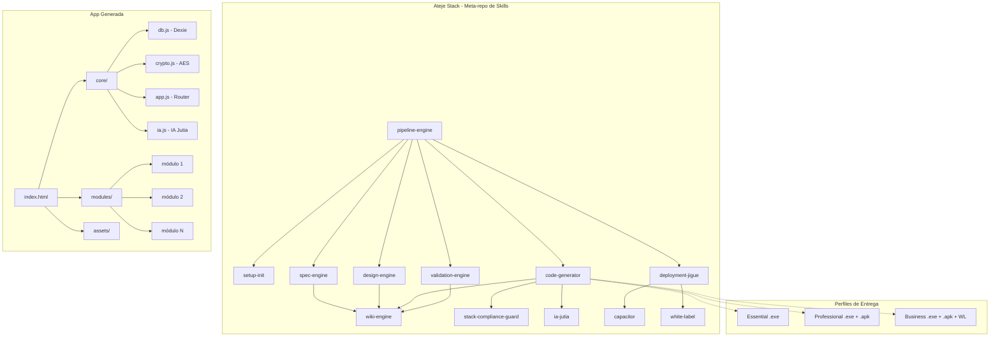
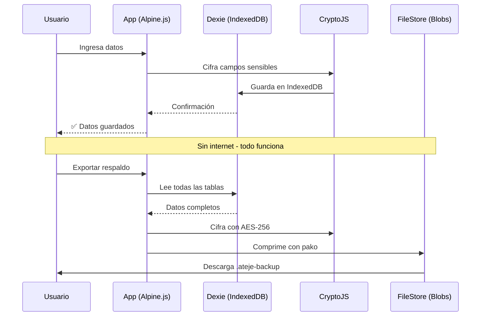

# Ateje Stack — Presentación Comercial Completa

> **Documento de venta y posicionamiento para inversores, clientes y partners**
> Creado por Angel Hernández Aguilera — [ahaguilera.dev](https://ahaguilera.dev)

---

## Índice

1. [¿Qué es Ateje Stack?](#1-qué-es-ateje-stack)
2. [El Problema que Resuelve](#2-el-problema-que-resuelve)
3. [Arquitectura del Stack](#3-arquitectura-del-stack)
4. [Catálogo de AHApps](#4-catálogo-de-ahapps)
5. [Verticales de Negocio](#5-verticales-de-negocio)
6. [Tabla Única de Precios](#6-tabla-única-de-precios)
7. [Comparativa de Perfiles (Feature Flags)](#7-comparativa-de-perfiles-feature-flags)
8. [IA Jutia — Motor de Inteligencia Artificial Offline](#8-ia-jutia--motor-de-inteligencia-artificial-offline)
9. [Selección de Mercado y Público Objetivo](#9-selección-de-mercado-y-público-objetivo)
10. [Ventajas Competitivas](#10-ventajas-competitivas)
11. [Resultados Esperados y Proyecciones](#11-resultados-esperados-y-proyecciones)
12. [Roadmap Comercial](#12-roadmap-comercial)
13. [Preguntas de Descubrimiento por Vertical](#13-preguntas-de-descubrimiento-por-vertical)

---

## 1. ¿Qué es Ateje Stack?

**Ateje Stack** es una fábrica de software B2B offline-first que genera aplicaciones de escritorio (.exe) y móviles (.apk) que funcionan **100% sin internet, sin servidores, sin mensualidades**.

No es SaaS. Es software que el cliente compra una vez y le pertenece para siempre.

### Manifiesto

| Principio | Significado |
|-----------|-------------|
| **Offline-first** | La app funciona completa sin internet. Sincronización opcional, nunca obligatoria. |
| **Pago único** | El cliente paga una vez. No hay suscripciones, no hay cuotas mensuales. |
| **Sin vendor lock-in** | Datos cifrados con AES-256, exportables, portables. El cliente no queda atrapado. |
| **IA incluida** | Cada app trae IA Jutia integrada (búsqueda, estadísticas, predicciones) sin costo adicional. |
| **Código compartido** | ~95% del frontend es idéntico entre todas las apps y perfiles. |
| **Sin builds complejas** | El perfil Essential se entrega como .exe listo para ejecutar. |

### Perfiles Técnicos vs Niveles Comerciales

Cada nivel comercial mapea a un perfil técnico específico:

```
NIVEL COMERCIAL          PERFIL TÉCNICO         ENTREGABLE
─────────────────────────────────────────────────────────────
Essential    ─────────►  Lite                    .exe (Neutralino)
Professional ─────────►  Professional            .exe + .apk
Business     ─────────►  Business                .exe + .apk + white-label
```

### Stack Tecnológico

| Tecnología | Versión | Rol |
|-----------|:-------:|-----|
| **Alpine.js** | 3.14+ | Reactividad declarativa |
| **Dexie.js** | 4.0+ | IndexedDB wrapper (CRUD offline) |
| **CryptoJS** | 4.2+ | Cifrado AES de campos sensibles |
| **Tailwind CSS** | 2.2+ | CSS utility-first (local, sin CDN) |
| **DaisyUI** | 4.12+ | Componentes UI |
| **Bootstrap Icons** | 1.11+ | Iconos vectoriales locales |
| **Chart.js** | 4.4+ | Gráficos interactivos |
| **jsPDF** | 2.5+ | Exportación PDF offline |
| **SheetJS (xlsx)** | 0.20+ | Exportación Excel offline |
| **NeutralinoJS** | latest | Runtime .exe nativo (~2MB, sin Java ni Node) |
| **Capacitor** | latest | Runtime .apk Android nativo |

---

## 2. El Problema que Resuelve

### Para el pequeño negocio LATAM

| Problema | Realidad actual | Solución AHA |
|----------|----------------|--------------|
| Internet no llega o es caro | Usan libretas, Excel, o apps que se caen sin conexión | La app funciona siempre, con o sin internet |
| SaaS es caro ($20-50 USD/mes por usuario) | Pagan $240-$600 USD/año por empleado | Pago único de por vida |
| No saben de tecnología | Dependen de familiares, "el de sistemas", o nadie | Doble clic y funciona |
| Datos personales de clientes en la nube | Riesgo de filtración | Datos 100% locales, cifrados con AES-256 |
| Quieren probar antes de comprar | Demos limitadas, trials con tarjeta de crédito | Essential es .exe funcional, 30 registros, sin límite de tiempo |

### Para el freelancer/desarrollador que vende software

| Problema | Solución Ateje |
|----------|----------------|
| Cada cliente pide algo diferente | 14 plantillas listas para personalizar |
| Tarda meses en desarrollar cada app | Skills de generación que producen apps en horas |
| Competir con SaaS grandes es imposible | Nicho offline-first, pago único, sin competencia real |
| El cliente no paga mensualidades | Venta única con licencia perpetua |
| El código se vuelve difícil de mantener | Stack unificado, 95% de código compartido entre apps |

---

## 3. Arquitectura del Stack



### Flujo de Datos Offline



---

## 4. Catálogo de AHApps

El repositorio incluye **14 plantillas de apps** listas para generar con el pipeline. Cada una tiene: spec técnica, módulos, tablas Dexie, pricing y mensaje pre-llenado para venta vía WhatsApp.

### AHA POS — Punto de Venta
- **Target:** Tiendas de abarrotes, ferreterías, minimarkets, farmacias
- **Módulos:** Productos, Ventas, Corte de caja, Devoluciones, Reportes
- **Diferenciador:** Funciona sin internet, corte de caja automatizado, ticket personalizable
- **WhatsApp:** *"Hola Angel, necesito un punto de venta offline para mi tienda sin pagar mensualidades. ¿AHA POS plan Professional con .exe y .apk?"*

### AHA Inventario — Control de Inventarios
- **Target:** Negocios con mercancía, almacenes, bodegas
- **Módulos:** Productos, Movimientos, Ajustes, Reportes
- **Diferenciador:** Alertas de stock mínimo, movimientos con costo promedio
- **WhatsApp:** *"Hola Angel, necesito controlar mi inventario sin pagar mensualidades. ¿AHA Inventario plan Professional?"*

### AHA Comanda — Gestión de Pedidos para Restaurantes
- **Target:** Restaurantes, bares, cafeterías, taquerías, food trucks
- **Módulos:** Mesas (mapa visual), Pedidos, Menú, Cuentas (split + corte)
- **Diferenciador:** Mapa visual de mesas con estado en tiempo real, split de cuentas, envío a cocina
- **WhatsApp:** *"Hola Angel, vi la AHA Comanda para mi restaurante. ¿Puedo tener el .exe y .apk con todos los módulos? Me interesa el plan Professional."*

### AHA Citas — Agenda y Reservaciones
- **Target:** Barberías, peluquerías, salones de uñas, spas, consultorios
- **Módulos:** Agenda, Calendario, Clientes, Servicios
- **Diferenciador:** Vista semanal drag & drop, recordatorios automáticos, historial por cliente
- **WhatsApp:** *"Hola Angel, necesito organizar las citas de mi barbería sin pagar mensualidades. ¿AHA Citas plan Professional con .exe y .apk?"*

### AHA Rx — Recetas Médicas
- **Target:** Médicos independientes, dentistas, fisioterapeutas, farmacias
- **Módulos:** Pacientes, Medicamentos, Recetas, Historial clínico
- **Diferenciador:** Generación de PDF con formato médico, historial cronológico, búsqueda por diagnóstico

### AHA CRM — Gestión de Clientes
- **Target:** Vendedores, freelancers, agentes de seguros, inmobiliarias
- **Módulos:** Contactos, Pipeline de ventas, Cotizaciones, Facturación
- **Diferenciador:** Pipeline visual con etapas, cotizaciones convertibles a facturas
- **WhatsApp:** *"Hola Angel, necesito un CRM offline para gestionar mis clientes y ventas sin mensualidades. ¿AHA CRM con pipeline Kanban?"*

### AHA Contactos — Agenda Inteligente
- **Target:** Cualquier negocio con clientes frecuentes
- **Módulos:** Directorio, Etiquetas, Grupos
- **Diferenciador:** Recordatorios de cumpleaños, historial de interacciones, plantillas WhatsApp

### AHA Gastos — Control Financiero
- **Target:** Dueños de negocio que quieren saber a dónde se va el dinero
- **Módulos:** Presupuestos, Transacciones, Categorías, Reportes, Dashboard KPIs
- **Diferenciador:** Dashboard de KPIs, alertas de presupuesto, gráficos por categoría, predicción de gastos

### AHA PreFactura — Cotizaciones y Facturación
- **Target:** Freelancers, contratistas, pequeñas empresas que facturan
- **Módulos:** Clientes, Productos/Servicios, Cotizaciones, Facturas, Plantillas
- **Diferenciador:** Cotización → Factura con un clic, folio automático, export PDF

### AHA Campo — Registro Agrícola
- **Target:** Agricultores, ganaderos, ingenieros agrónomos, dueños de ranchos
- **Módulos:** Lotes, Cultivos (ciclos), Insumos, Cosechas (movimientos), Animales, Eventos
- **Diferenciador:** Registro offline desde el campo, fotos desde cámara, alertas de insumos
- **WhatsApp:** *"Hola Angel, trabajo en el campo y casi nunca tengo internet. Quiero AHA Campo para llevar registro de mis lotes y ganado desde el celular. Plan Professional con .apk."*

### AHA Obra — Control de Construcción
- **Target:** Constructores, arquitectos, maestros de obra, contratistas
- **Módulos:** Dashboard, Etapas, Materiales, Personal/Gastos, Reportes
- **Diferenciador:** Comparativa presupuesto vs gasto real, fotos de avance por etapa, reportes PDF
- **WhatsApp:** *"Hola Angel, necesito controlar los gastos y avance de mis obras sin pagar mensualidades. ¿AHA Obra plan Professional con .exe y .apk?"*

### AHA Checklist — Inspecciones Técnicas
- **Target:** Supervisores de mantenimiento, seguridad, limpieza, auditorías
- **Módulos:** Plantillas, Ubicaciones, Equipos, Reportes
- **Diferenciador:** Firma digital del inspector, fotos desde cámara, PDF con evidencias
- **WhatsApp:** *"Hola Angel, necesito un sistema de inspecciones offline para mantenimiento. Me interesa AHA Checklist plan Professional con .exe y .apk."*

### AHA Flota — Control de Vehículos
- **Target:** Transportistas, flotillas, repartidores, empresas de logística
- **Módulos:** Vehículos, Combustible, Mantenimiento, Incidentes
- **Diferenciador:** Cálculo automático de rendimiento km/litro, alertas de mantenimiento programado
- **WhatsApp:** *"Hola Angel, necesito controlar los gastos de mis vehículos sin pagar mensualidades. ¿AHA Flota plan Professional con .exe y .apk?"*

### AHA Asistencia — Control de Empleados
- **Target:** Pequeñas empresas, tiendas, restaurantes, talleres con empleados
- **Módulos:** Empleados, Marcaje (check-in/out), QR, Reportes
- **Diferenciador:** Sin costo por empleado, marcaje por QR, reportes exportables a CSV para nómina
- **WhatsApp:** *"Hola Angel, quiero dejar de pagar suscripción por el control de asistencia. ¿AHA Asistencia plan Professional con .exe y .apk me sirve para 15 empleados?"*

---

## 5. Verticales de Negocio

Cada vertical es un "kit" armado de apps que cubren todas las necesidades operativas de un tipo de negocio. Se vende como paquete a un precio preferencial.

### VERTICAL 1: COMERCIO & RETAIL
**Target:** Tiendas de abarrotes, ferreterías, farmacias, papelerías, minimarkets, refaccionarías
**Dolor:** *"Si se va internet no cobro y no sé qué tengo en stock"*

| App | Rol |
|-----|-----|
| **AHA POS** | ⭐ Motor de cobro |
| AHA Inventario | Control de existencias y mermas |
| AHA PreFactura | Cotizaciones y facturación |
| AHA Gastos | Control financiero diario |
| AHA Contactos | Proveedores y clientes frecuentes |

📦 **Kit:** POS + Inventario + PreFactura + Gastos + Contactos

| Perfil | Precio |
|--------|:------:|
| Essential | $199 |
| Professional | $399 |
| Business | $699 |

---

### VERTICAL 2: GASTRONOMÍA
**Target:** Restaurantes, bares, cafeterías, taquerías, food trucks, comedores
**Dolor:** *"Los pedidos en papel se pierden y la cocina tarda"*

| App | Rol |
|-----|-----|
| **AHA Comanda** | ⭐ Motor de pedidos |
| AHA POS | Cobro y corte de caja |
| AHA Inventario | Control de insumos y mermas |
| AHA Gastos | Control de gastos operativos |
| AHA Asistencia | Control de meseros y cocineros |

📦 **Kit:** Comanda + POS + Inventario + Gastos + Asistencia

| Perfil | Precio |
|--------|:------:|
| Essential | $249 |
| Professional | $449 |
| Business | $849 |

---

### VERTICAL 3: BELLEZA & SERVICIOS
**Target:** Barberías, peluquerías, salones de uñas, spas, tatuadores, estética
**Dolor:** *"Se me cruzan las citas y pierdo clientes"*

| App | Rol |
|-----|-----|
| **AHA Citas** | ⭐ Agenda visual |
| AHA Contactos | Historial y seguimiento |
| AHA Gastos | Control financiero |
| AHA Asistencia | Control de estilistas/barberos |

📦 **Kit:** Citas + Contactos + Gastos + Asistencia

| Perfil | Precio |
|--------|:------:|
| Essential | $179 |
| Professional | $349 |
| Business | $699 |

---

### VERTICAL 4: SALUD & CONSULTORIOS
**Target:** Médicos independientes, dentistas, fisioterapeutas, psicólogos, farmacias
**Dolor:** *"Mis recetas se pierden y no tengo historial clínico digital"*

| App | Rol |
|-----|-----|
| **AHA Rx** | ⭐ Recetas e historial clínico |
| AHA Citas | Agenda de consultas |
| AHA Contactos | Directorio de pacientes |
| AHA PreFactura | Facturación de consultas |
| AHA Gastos | Control financiero del consultorio |

📦 **Kit:** Rx + Citas + Contactos + PreFactura + Gastos

| Perfil | Precio |
|--------|:------:|
| Essential | $199 |
| Professional | $399 |
| Business | $799 |

---

### VERTICAL 5: CONSTRUCCIÓN & OBRA
**Target:** Constructores, arquitectos, maestros de obra, contratistas, ingenieros civiles
**Dolor:** *"Los gastos de obra se me disparan y no tengo control del avance"*

| App | Rol |
|-----|-----|
| **AHA Obra** | ⭐ Control de obra y avance |
| AHA Checklist | Inspecciones y calidad |
| AHA PreFactura | Certificaciones y facturación |
| AHA Gastos | Control presupuestario |

📦 **Kit:** Obra + Checklist + PreFactura + Gastos

| Perfil | Precio |
|--------|:------:|
| Essential | $249 |
| Professional | $499 |
| Business | $999 |

---

### VERTICAL 6: AGRO & CAMPO
**Target:** Agricultores, ganaderos, dueños de ranchos, cooperativas
**Dolor:** *"En el campo no hay internet. Llevo todo en libreta y pierdo datos"*

| App | Rol |
|-----|-----|
| **AHA Campo** | ⭐ Registro de cultivos y cosechas |
| AHA Inventario | Control de insumos agropecuarios |
| AHA Flota | Control de vehículos y maquinaria |
| AHA Gastos | Control financiero del ciclo agrícola |

📦 **Kit:** Campo + Inventario + Flota + Gastos

| Perfil | Precio |
|--------|:------:|
| Essential | $199 |
| Professional | $399 |
| Business | $799 |

---

### VERTICAL 7: LOGÍSTICA & TRANSPORTE
**Target:** Transportistas, flotillas, repartidores, empresas de logística
**Dolor:** *"No sé cuánto gasto en gasolina ni cuándo le toca mantenimiento a cada vehículo"*

| App | Rol |
|-----|-----|
| **AHA Flota** | ⭐ Control de vehículos y gastos |
| AHA Checklist | Inspecciones de unidades |
| AHA Asistencia | Control de operadores y choferes |
| AHA Gastos | Gastos operativos de la flota |

📦 **Kit:** Flota + Checklist + Asistencia + Gastos

| Perfil | Precio |
|--------|:------:|
| Essential | $199 |
| Professional | $399 |
| Business | $799 |

---

### VERTICAL 8: OFICINA & FREELANCERS
**Target:** Contadores, abogados, arquitectos, diseñadores, agentes de seguros, freelancers
**Dolor:** *"Tengo clientes en WhatsApp, Excel y correos — no tengo un solo lugar"*

| App | Rol |
|-----|-----|
| **AHA CRM** | ⭐ Pipeline de oportunidades |
| AHA Contactos | Agenda y directorio |
| AHA PreFactura | Cotizaciones y facturación |
| AHA Gastos | Control financiero |

📦 **Kit:** CRM + Contactos + PreFactura + Gastos

| Perfil | Precio |
|--------|:------:|
| Essential | $149 |
| Professional | $299 |
| Business | $599 |

---

## 6. Tabla Única de Precios

### Apps Individuales — Precios Base

| App | Essential | Professional | Business |
|-----|:---------:|:------------:|:--------:|
| AHA POS | $49 | $99 | $199 |
| AHA Inventario | $49 | $99 | $199 |
| AHA Comanda | $49 | $99 | $199 |
| AHA Citas | $49 | $99 | $199 |
| AHA Rx | $49 | $99 | $149 |
| AHA CRM | $49 | $99 | $199 |
| AHA Contactos | $39 | $79 | $149 |
| AHA Gastos | $39 | $79 | $149 |
| AHA PreFactura | $29 | $49 | $99 |
| AHA Campo | $49 | $99 | $199 |
| AHA Obra | $49 | $99 | $199 |
| AHA Checklist | $49 | $99 | $199 |
| AHA Flota | $49 | $99 | $199 |
| AHA Asistencia | $49 | $99 | $199 |
| AHA Base | Gratis | $49 | $149 |

> **Essential:** .exe funcional, 30 registros, IA Lite incluida. Ideal para probar.
> **Professional:** .exe + .apk, registros ilimitados, IA Full, export/sync/backup. Para uso real.
> **Business:** Todo lo de Professional + white-label + multi-user + API. Para empresas.

### Kits por Vertical

| Vertical | Essential | Professional | Business | Apps incluidas |
|----------|:---------:|:------------:|:--------:|----------------|
| Comercio & Retail | $199 | $399 | $699 | POS + Inventario + PreFactura + Gastos + Contactos |
| Gastronomía | $249 | $449 | $849 | Comanda + POS + Inventario + Gastos + Asistencia |
| Belleza & Servicios | $179 | $349 | $699 | Citas + Contactos + Gastos + Asistencia |
| Salud & Consultorios | $199 | $399 | $799 | Rx + Citas + Contactos + PreFactura + Gastos |
| Construcción & Obra | $249 | $499 | $999 | Obra + Checklist + PreFactura + Gastos |
| Agro & Campo | $199 | $399 | $799 | Campo + Inventario + Flota + Gastos |
| Logística & Transporte | $199 | $399 | $799 | Flota + Checklist + Asistencia + Gastos |
| Oficina & Freelancers | $149 | $299 | $599 | CRM + Contactos + PreFactura + Gastos |

> **Todos los precios son por app o kit, pago único, sin mensualidades.**
> App adicional al kit: -20% sobre precio individual.

### Economía para el Desarrollador/Revendedor

| Concepto | Precio |
|----------|:------:|
| Licencia de distribución anual | $499 USD/año (acceso a todas las plantillas) |
| Comisión por venta | 70% revendedor / 30% stack |
| White-label (marca propia) | +$200 USD/año |
| Soporte premium 48h (opcional) | $49 USD/año |
| Personalización de módulos | Cotización por hora |

---

## 7. Comparativa de Perfiles (Feature Flags)

Basado en el sistema `feature-flags.js` que controla cada plan en runtime:

| Feature | Essential (Lite) | Professional | Business |
|---------|:----------------:|:------------:|:--------:|
| **Max registros** | 30 | Ilimitado | Ilimitado |
| **Exportar datos** | ✅ (habilitado) | ✅ | ✅ |
| **Sync entre dispositivos** | ❌ | ✅ | ✅ |
| **Backup cifrado .ateje-backup** | ✅ (habilitado) | ✅ | ✅ |
| **White-label** | ❌ | ❌ | ✅ |
| **IA Jutia** | Lite (FlexSearch + stats + predict) | Full (QA + OCR + RAG) | Full (QA + OCR + RAG) |
| **Multi-usuario** | ❌ | ❌ | ✅ |
| **API access** | ❌ | ❌ | ✅ |
| **Max dispositivos** | 1 | 5 | 200 |
| **Formato entrega** | .exe (Neutralino) | .exe + .apk | .exe + .apk + white-label |
| **HTML visible para el cliente** | ✅ (Sí) | ❌ (No) | ❌ (No) |
| **Código fuente** | ❌ (No) | ❌ (No) | ✅ (Sí) |
| **Soporte** | Estándar | Estándar | Prioritario 48h |

---

## 8. IA Jutia — Motor de Inteligencia Artificial Offline

### ¿Qué es IA Jutia?

IA Jutia es un **Engine Transversal** que se inyecta en cada AHApp para dotarla de capacidades de IA **sin conexión a internet, sin APIs externas, sin costo recurrente**. Corre 100% local en el equipo del cliente.

```
┌─────────────────────────────────────────────────────────────┐
│                    AHA [App: CRM, POS, Rx...]               │
│  ┌───────────────────────────────────────────────────────┐  │
│  │  IA Jutia Engine — 💬 Botón flotante en toda la app  │  │
│  │                                                       │  │
│  │  ┌──────────────┐  ┌──────────────┐  ┌────────────┐  │  │
│  │  │  FlexSearch   │  │ Transformers │  │ Tesseract  │  │  │
│  │  │  (Búsqueda)  │  │  (QA/Embed)  │  │ (OCR)      │  │  │
│  │  └──────────────┘  └──────────────┘  └────────────┘  │  │
│  │                                                       │  │
│  │  ┌──────────────────────────────────────────────────┐ │  │
│  │  │  JutiaDB (Dexie) — historial de conversaciones   │ │  │
│  │  └──────────────────────────────────────────────────┘ │  │
│  │                                                       │  │
│  │  Capacidades: Stats 📊  |  Predict 🔮  |  Search 🔍  │  │
│  └───────────────────────────────────────────────────────┘  │
└─────────────────────────────────────────────────────────────┘
```

### Capacidades por Perfil

| Capacidad | Lite (Essential) | Full (Professional/Business) |
|-----------|:----------------:|:---------------------------:|
| Búsqueda instantánea (FlexSearch) | ✅ Fuzzy matching + autocompletado | ✅ Búsqueda semántica + híbrida |
| Chat contextual sobre los datos | ✅ (conversacional básico) | ✅ Preguntas en lenguaje natural |
| OCR en imágenes (Tesseract.js) | ❌ | ✅ Extracción de texto de fotos |
| Predicciones y alertas | ✅ Estadísticas + predicciones básicas | ✅ Alertas inteligentes + tendencias |
| Resúmenes automáticos | ❌ | ✅ Resumen de ventas/periodo |
| RAG (Generación Aumentada por Recuperación) | ❌ | ✅ Consulta tus datos con IA |
| Exportar resultados a PDF | ✅ | ✅ |
| Ingesta de PDF, DOCX, XLSX, CSV, MD | ❌ | ✅ |
| Atajo global `Cmd+K` desde cualquier pantalla | ✅ | ✅ |

### ¿Por qué es importante?

1. **Sin conexión = sin costo de API.** No hay llamadas a OpenAI, no hay tokens, no hay factura de AWS. La IA corre localmente.

2. **Sin dependencia de proveedores.** Si OpenAI sube precios o cambia su API, las apps AHA no se ven afectadas.

3. **Privacidad total.** Los datos del cliente nunca salen de su máquina.

4. **Valor percibido enorme.** Un cliente que compra control de gastos por $49 USD y además recibe una IA que responde preguntas sobre sus finanzas obtiene un valor que normalmente costaría $50-200 USD/mes.

5. **Diferenciador de venta.** Ninguna competencia offline-first ofrece IA integrada.

### Ejemplos de Uso por Vertical

| Vertical | Qué pregunta el cliente | Qué responde IA Jutia |
|----------|------------------------|-----------------------|
| Comercio | "¿Cuánto vendí la semana pasada?" | Busca en POS + Gastos y responde con dato |
| Gastronomía | "¿Cuál platillo se vende más los viernes?" | Analiza comanda + ventas por día |
| Salud | "¿Qué pacientes no han venido en 3 meses?" | Busca en Rx + Citas y lista los pacientes |
| Campo | "¿Cuánto gasté en fertilizante este ciclo?" | Consulta insumos + gastos por lote |
| Construcción | "¿Vamos bien con el presupuesto de la obra?" | Compara gasto real vs presupuesto por etapa |
| Flota | "¿Qué vehículo tiene el peor rendimiento?" | Calcula km/litro de todos los vehículos |
| Oficina | "¿Cuánto le facturé al cliente X este año?" | Busca en CRM + PreFactura y responde |
| Logística | "¿Cuándo le toca mantenimiento al camión 3?" | Alerta por kilometraje recorrido |

---

## 9. Selección de Mercado y Público Objetivo

### TAM (Total Addressable Market)

| Segmento | Estimado LATAM | Fuente |
|----------|:--------------:|--------|
| PYMES en LATAM | ~30 millones | INEGI, CEPAL |
| Negocios sin sistema digital | ~70-80% | McKinsey LATAM 2023 |
| Gasto mensual en software de gestión | $50-200 USD | Benchmarks regionales |
| Mercado total direccionable | **~$15,000 M USD/año** | Estimación conservadora |

### SAM (Serviceable Addressable Market)

| Nicho | Estimado | Cobertura |
|-------|:--------:|:---------:|
| Tiendas de abarrotes y retail pequeño | ~5M en LATAM | POS + Inventario |
| Barberías y salones de belleza | ~2M en LATAM | Citas + CRM |
| Restaurantes y food trucks | ~3M en LATAM | Comanda + POS |
| Consultorios médicos independientes | ~1.5M en LATAM | Rx + Citas |
| Constructores y contratistas pequeños | ~1M en LATAM | Obra + Checklist |
| Transportistas y flotillas pequeñas | ~500k en LATAM | Flota |
| Freelancers y oficinistas | ~10M en LATAM | CRM + PreFactura |
| **Total SAM** | **~20M negocios** | |

### Público Objetivo Primario

| Perfil | Edad | Características | Valora |
|--------|:----:|-----------------|--------|
| Dueño de negocio local | 40-55 | 1-3 sucursales, 3-15 empleados, WhatsApp + Excel | Que funcione sin internet, que sea simple, que sea suyo |
| Profesional independiente | 30-50 | Médico, abogado, contador, consultorio pequeño | Datos no en la nube, aspecto profesional |
| Freelancer/contratista | 25-40 | Constructor, agente, diseñador, trabajo móvil | PC + celular, poder facturar |

### Canales de Distribución

| Canal | Estrategia |
|-------|-----------|
| **WhatsApp directo** | Mensajes pre-escritos por app. Demo por video, pago por transferencia, envío del .exe |
| **Revendedores** | Técnicos de computación, papelerías, cybers → 30% comisión |
| **Facebook / Marketplace** | Publicaciones en grupos de cada vertical |
| **Ferias locales** | Stand con demo offline en laptop → captura de contactos |
| **Boca a boca** | "Mi primo tiene una tienda y le funciona" → el mejor canal LATAM |

---

## 10. Ventajas Competitivas

### Vs. SaaS (QuickBooks, Alegra, Zoho, Holded, Loggro, Buildertrend)

| Aspecto | SaaS | AHA |
|---------|:----:|:---:|
| Costo | $20-500 USD/mes | Pago único (sin mensualidad) |
| Internet | Obligatorio | Cero necesario |
| Datos del cliente | En servidores del proveedor | 100% locales, cifrados AES-256 |
| Personalización | Limitada | Total (Business: código fuente) |
| Velocidad | Depende del servidor | Instantánea (local) |
| Privacidad | El proveedor ve los datos | Solo el cliente tiene acceso |
| Vendor lock-in | Alto (migrar es difícil) | Cero (exporta y llévate tus datos) |
| Si dejas de pagar | Pierdes todo | La app sigue funcionando |
| IA | No incluida o add-on caro | Incluida en el precio |
| Español | Segundo idioma | Nativo (es-419) |
| Sin señal | No funciona | Funciona normal |

### Vs. Offline Tradicional (Eleventa, Pagotaco, sistemas de caja)

| Aspecto | Offline Tradicional | AHA |
|---------|:------------------:|:---:|
| Multiplataforma | Solo Windows | Windows (.exe) + Android (.apk) |
| IA incluida | No | Sí (FlexSearch + stats + predict + QA) |
| Cifrado AES-256 | No | Sí |
| Diseño | Interfaces antiguas | Alpine + DaisyUI (moderno) |
| Actualizaciones | CD-ROM / USB | ZIP / Descarga directa |
| Licenciamiento | Sin protección | Licencias .aha con RSA+AES |

### Ventajas Clave para el Cliente

1. **💵 Paga una vez, usa para siempre.** Sin sustos de fin de mes, sin renovaciones.
2. **📡 Funciona sin internet.** En el campo, en la obra, en el puesto del mercado.
3. **🔒 Sus datos son solo suyos.** Cifrados con AES-256, en su PC.
4. **🤖 Incluye IA sin costo recurrente.** No paga por API. La IA es parte del producto.
5. **🆓 Lo puede probar gratis.** Essential es .exe funcional, 30 registros, sin límite de tiempo.
6. **⚡ Lo recibe en 24 horas.** No espera meses por desarrollo.
7. **💳 No necesita tarjeta de crédito.** Pago vía transferencia, el .exe se entrega por WhatsApp.
8. **📱 Windows + Android.** Misma app, mismos datos, misma interfaz.

---

## 11. Resultados Esperados y Proyecciones

### ROI para el Cliente (PYME)

| Indicador | Antes | Después de AHA | Ahorro estimado |
|-----------|-------|-----------------|:---------------:|
| Pérdida por ventas no registradas | ~15-30% | <2% | $500-2,000/año |
| Tiempo en cierre de caja | 30-60 min/día | 2 min/día | 120h/año |
| Mermas por inventario descontrolado | ~10-20% | <3% | $300-1,500/año |
| Clientes perdidos por falta de seguimiento | ~20-40% | <5% | $1,000-5,000/año |
| Gastos hormiga no identificados | ~15-25% | <5% | $200-1,000/año |
| SaaS reemplazado | $30-500/mes | $0 | $360-6,000/año |

> **ROI típico:** El cliente recupera la inversión en 1-3 meses.

### Proyección de Ingresos (para el Revendedor)

| Mes | Clientes | Ticket prom. | Ingreso mensual |
|:---:|:--------:|:------------:|:---------------:|
| Mes 1-3 | 3-5 | $299 | $897 - $1,495 |
| Mes 4-6 | 5-10 | $349 | $1,745 - $3,490 |
| Mes 7-12 | 10-15 | $399 | $3,990 - $5,985 |
| Año 2 | 15-25/mes | $449 | $6,735 - $11,225 |

> **Meta realista:** 10 ventas/mes → $3,500 USD/mes → $42,000 USD/año.

### Proyección para el Inversor (2 años)

| Métrica | Proyección |
|---------|:----------:|
| Apps generadas | 500-1,000 |
| Clientes activos | 300-600 |
| Ingreso bruto | $150,000 - $300,000 USD |
| Revendedores activos | 20-50 |
| Verticales en producción | 8/8 |

---

## 12. Roadmap Comercial

### Fase 1 — Lanzamiento (Mes 1-3)
- [x] Catálogo completo de 14 apps AHA
- [x] 8 verticales de negocio definidas con precios
- [ ] Landing page de ventas profesional
- [ ] 3 casos de éxito documentados
- [ ] Video demo de 2 min por vertical estrella

### Fase 2 — Crecimiento (Mes 4-6)
- [ ] 5 revendedores activos en México
- [ ] Versión en portugués (Brasil)
- [ ] Integración con pasarelas de pago locales (Clip, MercadoPago)
- [ ] Marketplace de módulos adicionales

### Fase 3 — Escalamiento (Mes 7-12)
- [ ] 20+ revendedores en LATAM
- [ ] Tienda propia con descarga y licenciamiento automático
- [ ] Sincronización LAN local entre dispositivos (sin servidor)

### Fase 4 — Expansión (Año 2)
- [ ] 50+ revendedores
- [ ] Franquicia de desarrollo certificada
- [ ] Versión on-premise para empresas grandes
- [ ] IA Jutia con modelos especializados por vertical

---

## 13. Preguntas de Descubrimiento por Vertical

### Comercio & Retail
1. **¿Cuánto pagas actualmente por tu sistema de cobro o POS?** *(Identificar dolor económico)*
2. **¿Qué haces cuando se va el internet? ¿Anotas en libreta y luego capturas?** *(Identificar proceso actual)*
3. **¿Sabes exactamente cuánto dinero hay en tu caja ahorita?** *(Identificar falta de control)*
4. **¿Cada cuándo haces inventario físico? ¿Tus números nunca cuadran?** *(Identificar merma)*
5. **¿Te gustaría tener un solo sistema que haga: cobro + inventario + facturas + gastos?** *(Presentar el kit)*

### Gastronomía
1. **¿Cómo tomas pedidos ahorita? ¿Papel y después capturas?** *(Identificar proceso)*
2. **¿Se han perdido pedidos o se han ido a la cocina mal?** *(Identificar dolor)*
3. **¿Cuánto tiempo te toma hacer el corte de caja al final del día?** *(Medir ineficiencia)*
4. **¿Sabes qué platillo te deja más margen?** *(Introducir IA Jutia)*
5. **¿Tienes control de los insumos en la cocina o compras "al ojo"?** *(Vender inventario adicional)*

### Belleza & Servicios
1. **¿Cómo manejas las citas ahora? ¿WhatsApp o llamadas?** *(Identificar proceso)*
2. **¿Se te han cruzado citas o se te ha olvidado una?** *(Identificar dolor)*
3. **¿Das seguimiento a clientes que no vienen hace tiempo?** *(Vender IA + recordatorios)*
4. **¿Sabes cuánto dinero entra y sale cada mes?** *(Vender Gastos)*

### Salud & Consultorios
1. **¿Cómo llevas el historial de tus pacientes? ¿Expedientes en papel?** *(Identificar dolor)*
2. **¿Se te ha perdido una receta o un expediente?** *(Vender seguridad AES-256)*
3. **¿Tienes control de qué pacientes deben consulta de seguimiento?** *(Vender IA predictiva)*

### Construcción & Obra
1. **¿Cómo controlas el presupuesto de cada obra? ¿Excel?** *(Identificar proceso)*
2. **¿Cuántas veces te has pasado del presupuesto sin darte cuenta?** *(Identificar dolor)*
3. **¿Tienes fotos del avance de obra por etapa?** *(Vender módulo de fotos)*
4. **¿Tus clientes te piden reportes de avance?** *(Vender export PDF)*

### Agro & Campo
1. **¿Tienes internet en tu rancho/campo?** *(Validar necesidad offline)*
2. **¿Cómo llevas registro de siembras y cosechas?** *(Identificar proceso)*
3. **¿Sabes cuánto gastaste en fertilizantes este ciclo?** *(Vender control de gastos)*
4. **¿Qué lote te rinde más? ¿Tienes esos datos?** *(Vender IA + estadísticas)*

### Logística & Transporte
1. **¿Cómo controlas la gasolina de tus vehículos?** *(Identificar proceso)*
2. **¿Sabes cuál de tus vehículos gasta más?** *(Introducir estadísticas)*
3. **¿Cada cuándo les das mantenimiento? ¿Se te ha pasado alguno?** *(Vender alertas)*
4. **¿Tienes control de horarios de tus operadores?** *(Vender Asistencia)*

### Oficina & Freelancers
1. **¿Dónde tienes a tus clientes: WhatsApp, correo, Excel?** *(Identificar dispersión)*
2. **¿Cuánto tiempo pierdes buscando información de un cliente?** *(Medir ineficiencia)*
3. **¿Tus cotizaciones tienen formato consistente?** *(Vender PreFactura)*
4. **¿Sabes a quién tienes que dar seguimiento hoy?** *(Vender CRM + IA)*

---

> **Documento generado para presentación comercial del Ateje Stack.**
> Versión 2.0 — Julio 2026 (corregido con datos reales del stack)
> Contacto: Angel Hernández Aguilera — [ahaguilera.dev](https://ahaguilera.dev)
