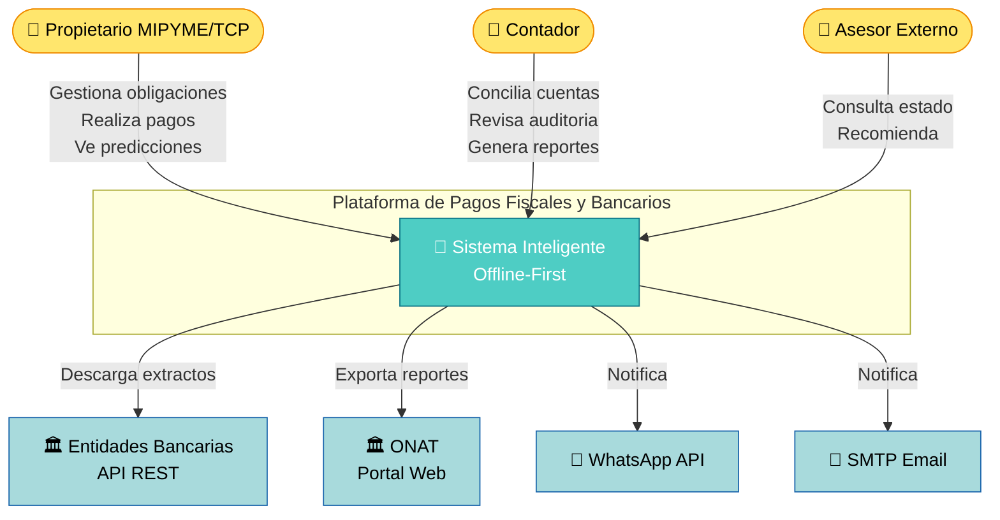

# ERD - Plataforma Inteligente de Pagos Fiscales y Bancarios

> **Version:** 2.0 (Refinado)
> **Stack:** Offline-first (Alpine.js + Dexie + CryptoJS)
> **Total entidades:** 15

---

## Diagrama ERD Completo

```mermaid
erDiagram
    EMPRESA {
        int id PK
        string nombre
        string tipo "MIPYME, TCP"
        string nit UK
        string direccion
        string telefono_principal
        string email_principal UK
        string regimen_fiscal "general, simplificado"
        string moneda_predeterminada "CUP, USD"
        string logo_url "nullable"
        bool activo "default true"
        datetime fecha_registro
        datetime fecha_actualizacion
    }

    USUARIO {
        int id PK
        string nombre_completo
        string email UK
        string telefono
        string rol "propietario, contador, asesor"
        string password_hash
        bool activo "default true"
        int intentos_fallidos "default 0"
        datetime ultimo_acceso
        datetime fecha_registro
        datetime fecha_actualizacion
    }

    USUARIO_EMPRESA {
        int id PK
        int usuario_id FK
        int empresa_id FK
        string permiso "admin, solo_lectura"
        datetime fecha_asignacion
        datetime fecha_actualizacion
    }

    SESION_USUARIO {
        int id PK
        int usuario_id FK
        string token UK
        string dispositivo
        string direccion_ip
        datetime fecha_inicio
        datetime fecha_expiracion
        datetime fecha_cierre
        bool activa "default true"
    }

    CUENTA_BANCARIA {
        int id PK
        int empresa_id FK
        string banco
        string codigo_banco
        string sucursal
        string numero_cuenta UK
        string tipo_cuenta "corriente, ahorro"
        string moneda "CUP, USD, MLC"
        string titular
        decimal saldo_actual "decimal(15,2)"
        decimal saldo_disponible "decimal(15,2)"
        date fecha_apertura
        bool activa "default true"
        datetime fecha_actualizacion
    }

    TASA_INTERES {
        int id PK
        string nombre "prestamo_comercial, credito_personal"
        string tipo "fija, variable"
        decimal valor_porcentual "decimal(5,2)"
        string moneda
        date fecha_vigencia_desde
        date fecha_vigencia_hasta
    }

    OBLIGACION_FISCAL {
        int id PK
        int empresa_id FK
        string concepto "ONAT, ISR, IASS, IVA, OSDE"
        decimal monto_base "decimal(15,2)"
        date fecha_vencimiento
        string frecuencia "mensual, trimestral, anual, unico"
        string estado "pendiente, pagado, atrasado, condonado"
        string referencia_legal
        text descripcion
        datetime fecha_creacion
        datetime fecha_actualizacion
    }

    OBLIGACION_BANCARIA {
        int id PK
        int empresa_id FK
        int cuenta_bancaria_id FK "cuenta asociada al credito"
        int tasa_interes_id FK "nullable"
        string tipo "prestamo, credito, leasing, hipoteca"
        decimal monto_original "decimal(15,2)"
        decimal saldo_pendiente "decimal(15,2)"
        decimal cuota_mensual "decimal(15,2)"
        decimal tasa_interes_nominal "decimal(5,2)"
        int plazo_meses
        date fecha_inicio
        date fecha_vencimiento_final
        string estado "activo, pagado, moroso, reestructurado"
        datetime fecha_actualizacion
    }

    TRANSACCION_BANCARIA {
        int id PK
        int cuenta_bancaria_id FK
        string tipo "ingreso, gasto, transferencia"
        string categoria "ventas, nomina, servicios, impuestos, etc."
        decimal monto "decimal(15,2)"
        decimal saldo_posterior "decimal(15,2)"
        date fecha_transaccion
        string descripcion
        string referencia_bancaria
        string numero_cheque "nullable"
        bool conciliado "default false"
        int conciliado_por "FK usuario_id, nullable"
        datetime fecha_conciliacion "nullable"
        datetime fecha_registro
    }

    PAGO {
        int id PK
        int empresa_id FK
        int obligacion_fiscal_id FK "nullable"
        int obligacion_bancaria_id FK "nullable"
        int cuenta_bancaria_id FK "cuenta origen"
        decimal monto_pagado "decimal(15,2)"
        decimal monto_cargos "decimal(15,2) default 0"
        date fecha_pago
        datetime fecha_registro_pago
        string metodo_pago "transferencia, efectivo, cheque, tarjeta"
        string comprobante
        string estado "pendiente_conciliacion, completado, fallido, revertido"
        string referencia_conciliacion "nullable"
        text notas
        datetime fecha_actualizacion
    }

    CONCILIACION_BANCARIA {
        int id PK
        int cuenta_bancaria_id FK
        int realizada_por "FK usuario_id"
        date periodo_inicio
        date periodo_fin
        decimal saldo_segun_libros "decimal(15,2)"
        decimal saldo_segun_banco "decimal(15,2)"
        decimal diferencia "decimal(15,2)"
        string estado "borrador, completada, aprobada"
        text notas
        datetime fecha_creacion
        datetime fecha_aprobacion "nullable"
    }

    DOCUMENTO_ADJUNTO {
        int id PK
        int empresa_id FK
        int pago_id FK "nullable"
        int obligacion_fiscal_id FK "nullable"
        int obligacion_bancaria_id FK "nullable"
        string nombre_archivo
        string tipo_mime "pdf, jpg, png, xlsx"
        int tamano_bytes
        string hash_sha256
        string ruta_almacenamiento
        datetime fecha_subida
        int subido_por "FK usuario_id"
    }

    PREDICCION_IA {
        int id PK
        int empresa_id FK
        date periodo_inicio
        date periodo_fin
        decimal ingreso_estimado "decimal(15,2)"
        decimal gasto_estimado "decimal(15,2)"
        decimal riesgo_incumplimiento_porcentaje "decimal(5,2)"
        decimal reserva_fiscal_sugerida "decimal(15,2)"
        decimal nivel_confianza "decimal(3,2)"
        string modelo_version
        text recomendaciones_calendario
        datetime fecha_generacion
    }

    NOTIFICACION {
        int id PK
        int empresa_id FK
        int usuario_id FK "destinatario, nullable"
        int obligacion_fiscal_id FK "nullable"
        int obligacion_bancaria_id FK "nullable"
        string canal "whatsapp, sms, app, email"
        string tipo_notificacion "recordatorio_vencimiento, alerta_morosidad, resumen_semanal, prediccion_ia"
        string titulo
        string mensaje
        bool leida "default false"
        datetime fecha_lectura "nullable"
        datetime fecha_programada
        datetime fecha_envio_real "nullable"
        bool enviada
        int intentos_envio "default 0"
    }

    CONFIGURACION_ALERTA {
        int id PK
        int empresa_id FK UK
        bool alerta_7d "default true"
        bool alerta_15d "default true"
        bool alerta_30d "default true"
        bool alerta_morosidad "default true"
        bool notificar_whatsapp "default false"
        bool notificar_sms "default false"
        bool notificar_app "default true"
        bool notificar_email "default true"
        bool resumen_semanal "default true"
        datetime fecha_actualizacion
    }

    AUDITORIA_LOG {
        int id PK
        int empresa_id FK
        int usuario_id FK "nullable"
        string accion "crear, actualizar, eliminar, exportar, autenticar"
        string entidad_afectada
        int entidad_id
        text valor_anterior
        text valor_nuevo
        string direccion_ip
        text detalles
        datetime fecha_evento
    }

    CATEGORIA_PERSONALIZADA {
        int id PK
        int empresa_id FK
        string nombre "max 100 chars"
        string tipo "ingreso, gasto"
        string icono "Bootstrap Icons class"
        bool activa "default true"
    }

    PRESUPUESTO {
        int id PK
        int empresa_id FK
        string periodo "mensual, trimestral, anual"
        date fecha_inicio
        date fecha_fin
        decimal monto_planeado "decimal(15,2)"
        decimal monto_ejecutado "decimal(15,2) default 0"
        string categoria "nullable"
        datetime fecha_creacion
        datetime fecha_actualizacion
    }

    PLANTILLA_NOTIFICACION {
        int id PK
        string codigo UK "VEN_7D, ALERTA_MORA, RESUMEN_SEMANAL"
        string titulo_template "{{empresa}}, {{monto}}, {{fecha}}"
        string mensaje_template
        string canal "whatsapp, sms, app, email"
        bool activa "default true"
    }

    EMPRESA ||--o{ USUARIO_EMPRESA : tiene
    USUARIO ||--o{ USUARIO_EMPRESA : pertenece
    USUARIO ||--o{ SESION_USUARIO : inicia
    EMPRESA ||--o{ CUENTA_BANCARIA : posee
    EMPRESA ||--o{ OBLIGACION_FISCAL : debe
    EMPRESA ||--o{ OBLIGACION_BANCARIA : tiene
    EMPRESA ||--o{ PAGO : realiza
    EMPRESA ||--o{ PREDICCION_IA : genera
    EMPRESA ||--o{ NOTIFICACION : recibe
    EMPRESA ||--o{ AUDITORIA_LOG : registra
    EMPRESA ||--o{ CATEGORIA_PERSONALIZADA : define
    EMPRESA ||--o{ PRESUPUESTO : planifica
    EMPRESA ||--o{ DOCUMENTO_ADJUNTO : archiva
    EMPRESA ||--|| CONFIGURACION_ALERTA : configura
    CUENTA_BANCARIA ||--o{ TRANSACCION_BANCARIA : origina
    CUENTA_BANCARIA ||--o{ OBLIGACION_BANCARIA : respalda
    CUENTA_BANCARIA ||--o{ PAGO : usa
    CUENTA_BANCARIA ||--o{ CONCILIACION_BANCARIA : concilia
    OBLIGACION_FISCAL ||--o{ PAGO : cancela
    OBLIGACION_BANCARIA ||--o{ PAGO : amortiza
    OBLIGACION_BANCARIA }o--|| TASA_INTERES : referencia
    PAGO ||--o{ DOCUMENTO_ADJUNTO : adjunta
    OBLIGACION_FISCAL ||--o{ DOCUMENTO_ADJUNTO : adjunta
    OBLIGACION_BANCARIA ||--o{ DOCUMENTO_ADJUNTO : adjunta
    NOTIFICACION }o--o{ OBLIGACION_FISCAL : referencia
    NOTIFICACION }o--o{ OBLIGACION_BANCARIA : referencia
    USUARIO ||--o{ NOTIFICACION : recibe
    USUARIO ||--o{ AUDITORIA_LOG : ejecuta
    USUARIO ||--o{ CONCILIACION_BANCARIA : realiza
```

---

## Catalogo de Entidades

### Core

| Entidad | Proposito | Atributos clave | Relaciones principales |
|---------|-----------|-----------------|----------------------|
| **EMPRESA** | Persona juridica o TCP que usa la plataforma | nit (UK), regimen_fiscal, moneda_predeterminada | -> USUARIO_EMPRESA, CUENTA_BANCARIA, OBLIGACION_* |
| **USUARIO** | Persona que accede al sistema | email (UK), rol, intentos_fallidos | -> USUARIO_EMPRESA, SESION_USUARIO, NOTIFICACION |
| **USUARIO_EMPRESA** | M:N entre usuarios y empresas con permisos | permiso (admin, solo_lectura) | EMPRESA -- USUARIO |

### Financiero

| Entidad | Proposito | Atributos clave | Relaciones principales |
|---------|-----------|-----------------|----------------------|
| **CUENTA_BANCARIA** | Cuentas bancarias de la empresa | numero_cuenta (UK), moneda, saldo_actual | -> TRANSACCION, OBLIGACION_BANCARIA, CONCILIACION |
| **TRANSACCION_BANCARIA** | Movimientos individuales de una cuenta | saldo_posterior, conciliado, referencia_bancaria | <- CUENTA_BANCARIA |
| **CONCILIACION_BANCARIA** | Proceso de conciliacion periodico | saldo_segun_libros vs saldo_segun_banco, diferencia | <- CUENTA_BANCARIA, -> USUARIO |

### Obligaciones

| Entidad | Proposito | Atributos clave | Relaciones principales |
|---------|-----------|-----------------|----------------------|
| **OBLIGACION_FISCAL** | Impuestos y contribuciones (ONAT, ISR, IASS, etc.) | frecuencia (enum), estado, referencia_legal | -> PAGO, DOCUMENTO_ADJUNTO |
| **OBLIGACION_BANCARIA** | Creditos, prestamos y leasing | saldo_pendiente, cuota_mensual, tasa_interes_nominal, plazo_meses | -> PAGO, -> TASA_INTERES |

### Pagos

| Entidad | Proposito | Atributos clave | Relaciones principales |
|---------|-----------|-----------------|----------------------|
| **PAGO** | Registro de pago a una obligacion | estado (pendiente_conciliacion..revertido), metodo_pago, monto_cargos | -> OBLIGACION_FISCAL/BANCARIA, -> DOCUMENTO_ADJUNTO |

### Inteligencia

| Entidad | Proposito | Atributos clave | Relaciones principales |
|---------|-----------|-----------------|----------------------|
| **PREDICCION_IA** | Prediccion de ingresos/gastos/riesgo por periodo | periodo_inicio/fin, nivel_confianza, modelo_version | <- EMPRESA |

### Notificaciones

| Entidad | Proposito | Atributos clave | Relaciones principales |
|---------|-----------|-----------------|----------------------|
| **NOTIFICACION** | Mensaje enviado al usuario por cualquier canal | tipo_notificacion, canal, leida, intentos_envio | -> OBLIGACION_FISCAL/BANCARIA (opcional) |
| **CONFIGURACION_ALERTA** | Preferencias de notificacion por empresa (1:1) | alerta_7d/15d/30d, notificar_whatsapp/sms/app/email | <- EMPRESA |
| **PLANTILLA_NOTIFICACION** | Templates reutilizables con variables {{}} | codigo (UK), titulo_template, mensaje_template | *tabla de referencia* |

### Cumplimiento y Soporte

| Entidad | Proposito | Atributos clave | Relaciones principales |
|---------|-----------|-----------------|----------------------|
| **AUDITORIA_LOG** | Trazabilidad completa de todas las operaciones | accion, entidad_afectada, valor_anterior/nuevo, IP | <- EMPRESA, -> USUARIO |
| **DOCUMENTO_ADJUNTO** | Archivos adjuntos (comprobantes, contratos) | hash_sha256, tipo_mime, ruta_almacenamiento | -> PAGO, OBLIGACION_FISCAL, OBLIGACION_BANCARIA |
| **CATEGORIA_PERSONALIZADA** | Categorias de ingreso/gasto definidas por el usuario | tipo (ingreso, gasto), icono | <- EMPRESA |
| **PRESUPUESTO** | Planificacion financiera por periodo | monto_planeado, monto_ejecutado, periodo | <- EMPRESA |
| **TASA_INTERES** | Catalogo de tasas de interes vigentes | tipo (fija, variable), valor_porcentual, vigencia | -> OBLIGACION_BANCARIA |

---

## Reglas de Negocio Clave

1. **Cifrado obligatorio**: Los campos `nombre`, `email`, `telefono`, `direccion` en EMPRESA y USUARIO deben cifrarse con CryptoJS AES antes de persistir en IndexedDB.

2. **Auditoria**: Toda operacion CREATE, UPDATE, DELETE sobre cualquier entidad debe registrar un AUDITORIA_LOG con `valor_anterior` y `valor_nuevo` en JSON.

3. **Conciliacion**: Un PAGO en estado `pendiente_conciliacion` debe conciliarse dentro de los 7 dias posteriores a `fecha_pago` mediante CONCILIACION_BANCARIA.

4. **Prediccion**: PREDICCION_IA se recalcula automaticamente tras cada nuevo PAGO o cada 30 dias (lo que ocurra primero).

5. **Notificaciones**: Las notificaciones se programan segun CONFIGURACION_ALERTA. `alerta_7d` = 7 dias antes del vencimiento, `alerta_morosidad` = cuando estado pasa a `atrasado`/`moroso`.

6. **Sesiones**: SESION_USUARIO tiene expiracion de 24h. Al llegar a 5 `intentos_fallidos` en USUARIO, se bloquea la cuenta hasta reinicio manual.

7. **Integridad referencial**: Las FK a OBLIGACION_FISCAL y OBLIGACION_BANCARIA en PAGO son opcionales (nullable) porque un pago puede ser generico sin asociarse a una obligacion especifica.

---

## Diagrama de Arquitectura (Contexto C4)



---

## Indices Recomendados para Performance

```sql
-- Indices compuestos para consultas frecuentes
CREATE INDEX idx_pago_empresa_estado ON PAGO(empresa_id, estado);
CREATE INDEX idx_obligacion_fiscal_vencimiento ON OBLIGACION_FISCAL(empresa_id, fecha_vencimiento);
CREATE INDEX idx_transaccion_fecha ON TRANSACCION_BANCARIA(cuenta_bancaria_id, fecha_transaccion);
CREATE INDEX idx_notificacion_programada ON NOTIFICACION(empresa_id, fecha_programada, enviada);
CREATE INDEX idx_auditoria_fecha ON AUDITORIA_LOG(empresa_id, fecha_evento);
CREATE INDEX idx_prediccion_periodo ON PREDICCION_IA(empresa_id, periodo_inicio, periodo_fin);
CREATE INDEX idx_documento_obligacion ON DOCUMENTO_ADJUNTO(obligacion_fiscal_id);
CREATE INDEX idx_documento_pago ON DOCUMENTO_ADJUNTO(pago_id);
```

---

## Historial de Cambios

| Version | Fecha | Cambios |
|---------|-------|---------|
| 1.0 | — | ERD original con 11 entidades |
| 2.0 | 2026-06-14 | Refactor completo: +4 entidades (AUDITORIA_LOG, CONCILIACION_BANCARIA, DOCUMENTO_ADJUNTO, SESION_USUARIO, CATEGORIA_PERSONALIZADA, PRESUPUESTO, PLANTILLA_NOTIFICACION, TASA_INTERES), normalizacion 3FN, atributos de seguridad añadidos, documentacion arquitectonica |
