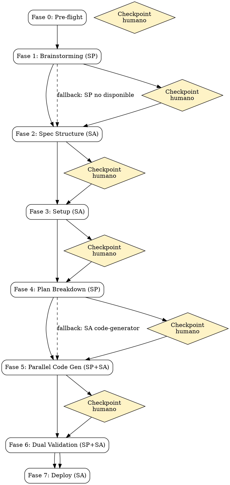

# SKILL: supercharged-pipeline (Pipeline Potenciado)

Orquesta **Superpowers** (metodologia general) + **SKILLS-AHAGUILERA** (dominio offline-first) en un flujo unificado de 7 fases con checkpoints.

## Requisitos

- Superpowers instalado como plugin en OpenCode (si no, fallback a SA clasico)
- SKILLS-AHAGUILERA skills instaladas en `~/.opencode/skills/`
- Proyecto nuevo (directorio vacio o repositorio Git inicializado)

---

## Fase 0: Pre-flight

Recolectar datos basicos del proyecto.

**Checklist:**
- [ ] Preguntar al usuario: **nombre de la app** (ej: "GestionInventario", "TaskManager")
- [ ] Preguntar: **tipo de app** (ej: "gestion de tareas", "inventario", "notas", "CRM")
- [ ] Preguntar: **descripcion breve** (1-2 lineas)
- [ ] Preguntar: **perfil** (`lite` o `full`)
- [ ] Preguntar: **IA Jutia?** (`si` o `no`; si `si`, pedir perfil Lite o Full)
- [ ] Guardar en `project.config.js`: nombre, tipo, descripcion, perfil, ia_jutia

**Output:** `project.config.js`

---

## Fase 1: Brainstorming (Superpowers)

Refinar la idea antes de escribir nada.

**Instruccion:**
```
skill tool to load supercharged-pipeline
```
No. Cargar la skill externa:
```
skill tool to load brainstorming
```

**Checklist:**
- [ ] Cargar skill `brainstorming` de Superpowers
- [ ] Dejar que brainstorming ejecute su ciclo completo:
  1. Explorar contexto del proyecto (project.config.js recien creado)
  2. Preguntas una a una (maximo 1 por mensaje)
  3. Proponer 2-3 enfoques con trade-offs y recomendacion
  4. Presentar diseno por secciones, obtener aprobacion tras cada seccion
  5. Guardar design doc en `docs/superpowers/specs/YYYY-MM-DD-<app>-design.md`
  6. Auto-revision del spec
  7. Usuario revisa spec
- [ ] Esperar que brainstorming invoque `writing-plans` — **NO dejar que ejecute writing-plans**. Interrumpir el flujo de SP aqui.

**Checkpoint humano:**
> "Design doc guardado en `docs/superpowers/specs/...`. ¿Aprobado para continuar con la especificacion tecnica?"

**Fallback (si Superpowers no esta instalado o brainstorming no disponible):**
> "Superpowers no detectado. Continuando con pipeline SKILLS-AHAGUILERA clasico."
> Saltar a Fase 2 directamente (spec-creator).

**Output:** `docs/superpowers/specs/YYYY-MM-DD-<app>-design.md`

---

## Fase 2: Spec Structure (SKILLS-AHAGUILERA)

Estructurar la especificacion tecnica a partir del design doc (o desde cero si hay fallback).

**Instruccion:**
```
skill tool to load spec-creator
```

**Checklist:**
- [ ] Cargar skill `spec-creator`
- [ ] Si existe design doc de SP, usarlo como contexto inicial
- [ ] Ejecutar el ciclo de spec-creator v4:
  1. Asunciones (4+1 refinamiento business/UX)
  2. Modelo de datos detallado (con columnas de perfil Lite/Full)
  3. User Journeys
  4. Testing Criteria
- [ ] Spec guardada en `specs/[app].md`

**Checkpoint humano:**
> "Spec lista en `specs/[app].md`. ¿Confirmas para continuar con el setup?"

**Output:** `specs/[app].md`

---

## Fase 3: Setup (SKILLS-AHAGUILERA)

Preparar el entorno y descargar librerias.

**Instruccion:**
```
skill tool to load setup-init
```

**Checklist:**
- [ ] Cargar skill `setup-init`
- [ ] Ejecutar setup segun perfil:
  - **Lite:** curl + .bat descarga en `assets/js/libs/`
  - **Full:** `bun init` + `bun add` en `node_modules/` + modelos IA (si aplica)
- [ ] Verificar que la estructura quedo correcta

**Checkpoint humano:**
> "Estructura creada y librerias instaladas. ¿Continuamos con el plan de implementacion?"

**Output:** Estructura de proyecto completa con assets/librerias

---

## Fase 4: Plan Breakdown (Superpowers)

Desglosar la spec en tareas pequenas e independientes.

**Instruccion:**
```
skill tool to load writing-plans
```

**Checklist:**
- [ ] Cargar skill `writing-plans` de Superpowers
- [ ] Pasarle como contexto: `specs/[app].md` y `project.config.js`
- [ ] Dejar que writing-plans genere tareas de 2-5 minutos con:
  - Ruta exacta del archivo a crear/modificar
  - Codigo completo o pseudo-codigo
  - Pasos de verificacion
- [ ] Cada tarea debe ser ejecutable por un subagente independiente
- [ ] Revisar que las tareas cubran:
  - Core: `core/db.js`, `core/crypto.js`, `core/ui.js`, `core/theme.js`, `core/app.js`
  - Modulos: uno por funcionalidad (`modules/[nombre]/module.js` + `module.html`)
  - Index: `index.html` (Lite) o `public/index.html` + `src/index.js` (Full)
  - IA: `core/ia.js` + `modules/ia-jutia/` (si aplica)
  - Config: `project.config.js`

**Checkpoint humano:**
> "Plan con N tareas generado. ¿Ejecuto la generacion paralela?"

**Fallback (si Superpowers no esta instalado):** Saltar a Fase 5 directamente usando code-generator de SA.

**Output:** Plan de implementacion (en contexto de la conversacion)

---

## Fase 5: Parallel Code Generation (Superpowers + SKILLS-AHAGUILERA)

Ejecutar tareas en paralelo usando subagentes, cada uno usando code-generator de SA.

**Instruccion:**
```
skill tool to load subagent-driven-development
```

**Checklist:**
- [ ] Cargar skill `subagent-driven-development` de Superpowers
- [ ] Agrupar tareas independientes para ejecucion paralela:
  - Batch 1: tareas core (db.js, crypto.js, ui.js, theme.js, app.js)
  - Batch 2: modulos de funcionalidad (2-3 subagentes en paralelo)
  - Batch 3: tareas restantes (index, config, IA si aplica)
- [ ] Cada subagente debe:
  1. Cargar `code-generator` de SA para el modulo especifico
  2. Generar el codigo segun templates SA
  3. Aplicar `stack-compliance-guard` automaticamente
  4. Reportar resultado
- [ ] Review en 2 etapas por cada tarea:
  1. **Spec compliance:** el codigo cumple la spec?
  2. **Code quality:** el codigo es limpio y sigue patrones?
- [ ] Issues criticales bloquean el avance. Issues menores se registran.

**Checkpoint humano:**
> "Modulos generados y revisados. Reporte: X modulos OK, Y issues menores, Z issues criticales. ¿Procedemos a validacion?"

**Output:** Todos los modulos de la app generados (`modules/*`, `core/*`, `index.html`)

---

## Fase 6: Dual Validation (Superpowers + SKILLS-AHAGUILERA)

Validacion en paralelo: calidad general (SP) + reglas del stack (SA) + tests (SA).

**Instruccion 1 (SP):**
```
skill tool to load requesting-code-review
```

**Instruccion 2 (SA):**
```
skill tool to load stack-compliance-guard
```

**Instruccion 3 (SA):**
```
skill tool to load validation-offline
```

**Checklist:**
- [ ] **SP requesting-code-review:** revisar codigo contra el plan. Reportar por severidad:
  - Critical: bloquea
  - Warning: requiere atencion
  - Info: sugerencia
- [ ] **SA stack-compliance-guard:** verificar reglas del stack:
  - Sin imports ES6 en archivos frontend
  - Sin CDNs en runtime
  - CryptoJS presente para cifrado
  - Librerias en assets/ (Lite) o node_modules/ (Full)
  - Sin fetch() para datos (usar Dexie)
  - Perfil correcto en todo el codigo
- [ ] **SA validation-offline:** ejecutar 3 fases:
  1. Validacion estatica
  2. Guia DevTools (consola, storage, lighthouse)
  3. Tests E2E con Playwright
- [ ] Recopilar resultados en `docs/validacion-[app].md`

**Checkpoint humano:**
> "Validacion completa. Reporte en `docs/validacion-[app].md`. Resultado: X critical, Y warnings, Z tests pass. ¿Procedemos a publicar?"

**Output:** `docs/validacion-[app].md`

---

## Fase 7: Deploy (SKILLS-AHAGUILERA)

Publicar la app.

**Instruccion:**
```
skill tool to load deployment-jigue
```

**Checklist:**
- [ ] Cargar skill `deployment-jigue`
- [ ] Ejecutar segun perfil:
  - **Lite:** commit + push + GitHub Pages + ZIP en `dist/`
  - **Full:** commit + push + `bun build --compile` + .exe en `dist/` + Release + Pages
- [ ] Confirmar URL de Pages y/o Release

**Mensaje final:**
> "Proyecto [app] completado exitosamente."
> "- App en GitHub Pages: https://[user].github.io/[repo]/"
> "- ZIP descargable: dist/[app].zip"
> "- Spec: specs/[app].md"
> "- Validacion: docs/validacion-[app].md"

**Output:** App publicada + empaquetada

---

## Resumen del flujo



## Fallback completo (sin Superpowers)

Si Superpowers no esta instalado, el pipeline se ejecuta como SA clasico:

1. Pre-flight (igual)
2. ~~Brainstorming~~ → **saltar**
3. Spec-creator (igual)
4. Setup-init (igual)
5. ~~Writing-plans~~ → **saltar**, usar code-generator directamente
6. ~~Subagent-driven-dev~~ → **saltar**, code-generator secuencial
7. Stack-compliance-guard + validation-offline (igual)
8. Deployment-jigue (igual)
